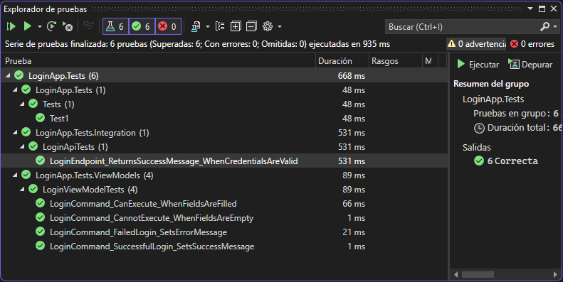
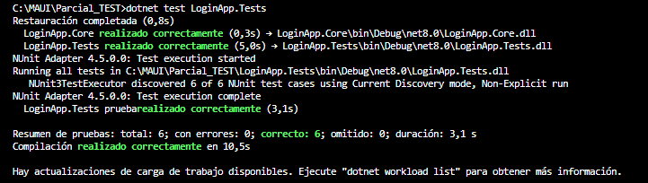
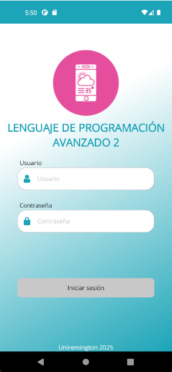
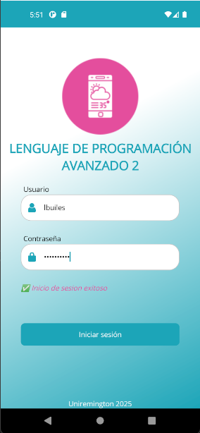
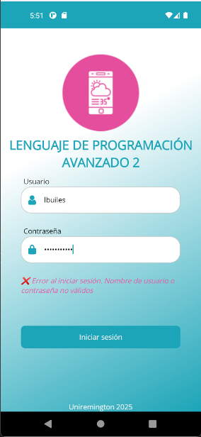

# LoginApp - Proyecto de Autenticación en .NET MAUI

Este proyecto corresponde a una aplicación de autenticación móvil desarrollada con **.NET MAUI**, que consume una **API REST PHP** real para validar credenciales de usuario. La solución aplica el patrón **MVVM**, utiliza la librería **CommunityToolkit.Mvvm**, y cuenta con pruebas automatizadas usando **NUnit y Moq**.

---

## Justificación Tecnológica

Este proyecto fue desarrollado en **.NET MAUI**, ya que es la tecnología que actualmente manejo profesionalmente.

Por razones de confidencialidad y políticas empresariales, no pude utilizar ninguna de las aplicaciones reales que tengo en curso, ya que están bajo acuerdos de privacidad y no pueden ser divulgadas públicamente.

Por lo tanto, se opté por crear un proyecto funcional desde cero con fines estrictamente académicos, cubriendo todos los requerimientos de la actividad solicitada.

## Estructura del Proyecto

```
Parcial_TEST/
├── LoginApp/              # Proyecto MAUI (interfaz de usuario)
├── LoginApp.Core/         # Lógica del dominio, servicios e interfaces
├── LoginApp.Tests/        # Pruebas unitarias e integración
│   └── Docs/
│       ├── images/        # Capturas del proceso y pruebas
│       └── README_LoginApp_FINAL.md
```

---

## 1. Configuración del Entorno

- Proyecto creado con Visual Studio 2022.
- Target Framework: `.NET 8.0`.
- Se utilizaron los paquetes:
  - `CommunityToolkit.Mvvm`
  - `NUnit`, `Moq`
  - `Microsoft.NET.Test.Sdk`
- Se organizaron los proyectos por capas para mantener el principio de responsabilidad única.

---

## 2. Implementación de Pruebas Unitarias

Se implementaron **4 pruebas unitarias** en el archivo `LoginViewModelTests.cs`:

- Verifica el login exitoso con mensaje correcto.
- Verifica el login fallido con credenciales inválidas.
- Valida que el comando `LoginCommand` no se ejecuta si los campos están vacíos.
- Verifica que se puede ejecutar el comando cuando los campos están llenos.

> Se utilizó `Moq` para simular `IAuthService` y aislar la lógica de negocio.

---

## 3. Prueba de Integración (API PHP)

Se creó un archivo `LoginApiTests.cs` que realiza una **petición real** a la API alojada en `https://app.agrodexsas.com/ApiApp/AgrdxApi.php`.

- Se envió un POST con credenciales reales (`lbuiles / lbuiles87*`).
- Se validó que el status code fuera `200 OK`.
- Se aseguró que el mensaje devuelto fuera `"Inicio de sesion exitoso"`.

> Esta prueba valida la conexión real con el backend desde la lógica del proyecto.

---

## 4. Ejecución de Pruebas

Las pruebas fueron ejecutadas desde:
- Explorador de pruebas en Visual Studio.
- Terminal con `dotnet test`.

Se obtuvieron **6 pruebas exitosas de 6 ejecutadas**.

### Evidencias

| Prueba en Explorador | Prueba en Terminal |
|----------------------|--------------------|
|  |  |

---

## 5. Vista de la App

Pantalla principal de Login con campos de entrada y resultado de login:

| Vista Login | Login Exitoso | Login Fallido |
|-------------|----------------|----------------|
|  |  |  |

---

## Conclusión

Este proyecto cumple con todos los criterios solicitados:

- Configuración del entorno con dependencias correctas
- Múltiples pruebas unitarias funcionales
- Prueba de integración real con API externa
- Ejecución validada y documentada
- Documentación completa en Markdown y PDF

---

Autor: **Leon Dario Builes Valencia**  
Curso: Lenguaje de Programación Avanzado 2 – Corporacion Universitaria Remington  
Año: 2025
