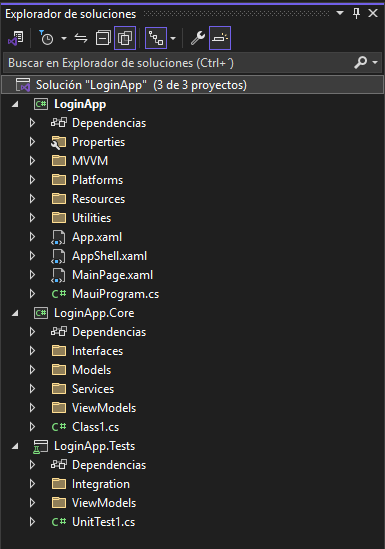

# LoginApp - Autenticación en .NET MAUI con API PHP y pruebas unitarias

Este proyecto es una aplicación de autenticación desarrollada con **.NET MAUI**, que consume una API PHP existente y valida el inicio de sesión del usuario. También incluye pruebas unitarias y de integración para verificar la lógica del ViewModel y el comportamiento real de la API.

---

## Tecnologías utilizadas

- [.NET MAUI](https://learn.microsoft.com/dotnet/maui/)
- [CommunityToolkit.MVVM](https://learn.microsoft.com/en-us/dotnet/communitytoolkit/mvvm/)
- [NUnit](https://nunit.org/)
- [Moq](https://github.com/moq/moq)
- [API PHP](https://www.php.net/)

---

## Estructura del proyecto



---

## Funcionalidad de Login

Pantalla inicial:


Error al iniciar sesión:


Inicio de sesión exitoso:


---

## Pruebas automatizadas

### Pruebas unitarias (`LoginViewModelTests.cs`)
- Validan comportamiento del ViewModel en distintos escenarios.
- Se usan `Moq` y `NUnit`.

### Prueba de integración real (`LoginApiTests.cs`)
- Conecta directamente al endpoint:
  `https://app.agrodexsas.com/ApiApp/AgrdxApi.php`
- Verifica que el login sea exitoso.

---

## Resultados de ejecución

Vista desde el Explorador de Pruebas:


Resultado desde terminal:


---

## Ejecutar las pruebas

```bash
dotnet test LoginApp.Tests
```

---

## Autor

Leon Dario Builes Valencia  
Proyecto desarrollado como entrega para la asignatura Lenguaje de Programación Avanzado 2 - Corpotación Universitaria Remington 2025.
